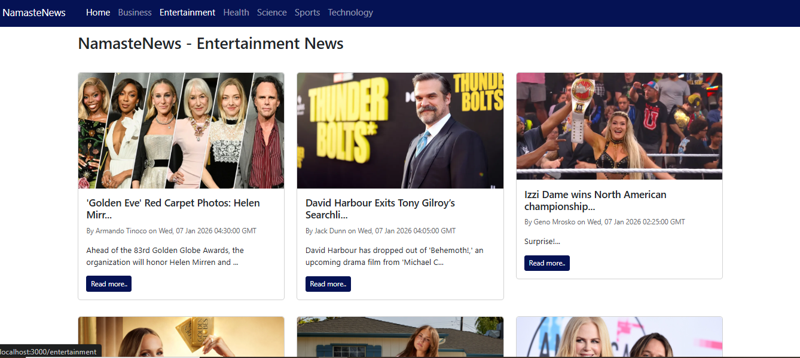
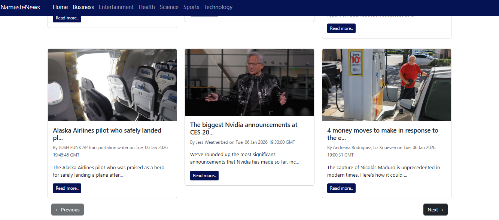
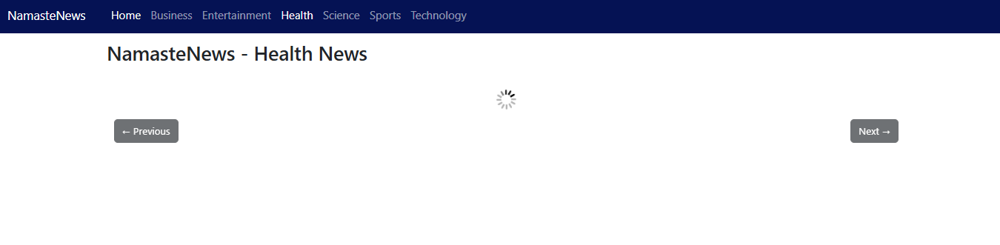

# NamasteNews

<p>A simple and modern news app built with React and NewsAPI.</p>
<!-- About Section -->
<h2 id="about">📖 About</h2>
<p>
  <strong>Namaste News</strong> is a lightweight and responsive news application built with <strong>React.js</strong>. It fetches real-time news from <strong>NewsAPI</strong> and displays the latest updates in different categories. The app has a clean UI and allows users to browse and search news articles effortlessly.
</p>

<!-- Features Section -->
<h2 id="features">✨ Features</h2>

<ul>
  <li>🔹 Fetches real-time news using NewsAPI</li>
  <li>🔹 Categorized news (Technology, Sports, Business, Health, etc.)</li>
  <li>🔹 Fully responsive design using CSS and bootstrap</li>
</ul>

Screenshots for quick view:-
<h4> HomePage </h4>

<h4> Category - entertainment </h4>

<h4>Pagination</h4>

<h4>Loading Spinner</h4>



<!-- Tech Stack Section -->
<h2 id="tech-stack">🛠️ Tech Stack</h2>

<table>
  <tr>
    <td><strong>Frontend</strong></td>
    <td>React.js, HTML, CSS</td>
  </tr>
  <tr>
    <td><strong>API</strong></td>
    <td>NewsAPI.org</td>
  </tr>
  <tr>
    <td><strong>Styling</strong></td>
    <td>CSS / Bootstrap </td>
  </tr>
</table>


<!-- Installation Section -->
<h2 id="installation">⚡ Installation</h2>

<p>Follow these steps to set up the project locally:</p>

```bash
# Clone the repository
git clone https://github.com/your-username/namaste-news.git

# Navigate to the project directory
cd namaste-news

# Install dependencies
npm install

# Start the development server
npm start
